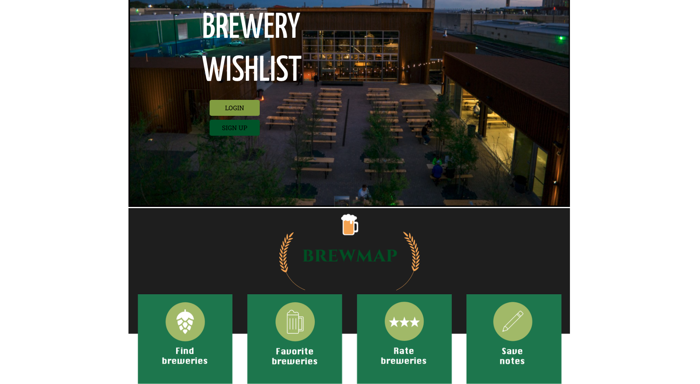
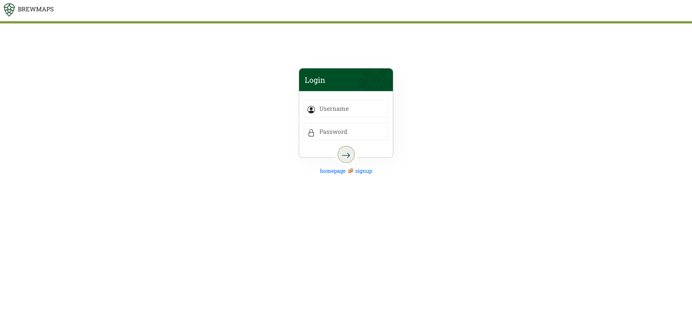
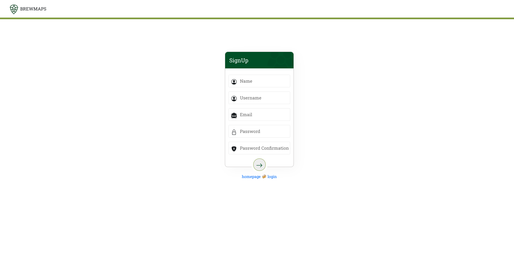

## BrewMaps

## Description

Brewery journaling application that allows users to favorite, rate and write reviews of breweries across the United States.

## Installation

1. Fork or clone the respository.
2. Cd into the frontend repo and run the following:

- `yarn start`
- `yarn start`

3. Fork or clone backend repository from: `https://github.com/dbpatnode/brewmaps_backend`

- `bundle install`
- `rails db:migrate`
- `rails s`

## Features

### 1. Account

- Login/Sign up/logout

### 2. Favorites list

- Add breweries to favorites
- Delete cards from favorites
- Add Ratings for breweries
- Add Comments about your experience

### 3. Find location on the map

- Click on pins to view more information about the brewery:

1. call breweries
2. view website
3. get directions from google maps

### Search Functoinality

- Search from map by location
- Search from brewery page based on name

## Demo

### Homepage

### Login

### Signup

### Map Features

## Map Search Functionality

## Brewery Index, Add Favorite and Other Functoinality

## Brewery Comments and ratings

## Delete Favorites

